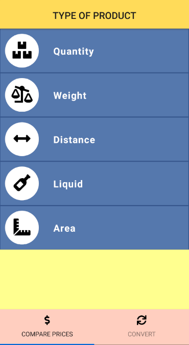
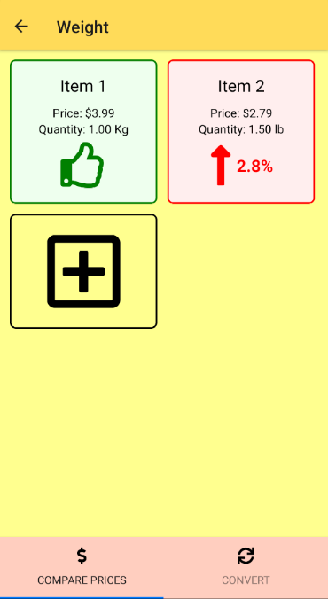
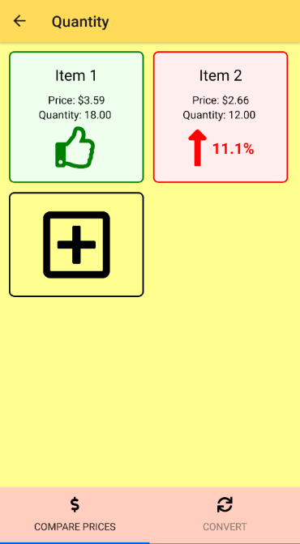

# Purpose
Price Examiner and Unit Converter is an Expo app that compares products of different sizes and prices.
In addition, you can also perform measurement unit conversions of Weight, Distance, Liquids, Area, Data transfer, Digital storage, energy, fuel, among others.

## Getting started
1. Clone this repo using `git clone https://github.com/Elson0509/peuc.git`
2. Move yourself to the appropriate directory: `cd peuc`
3. Run `npm install` to install dependencies
4. Run `npm start` so start the app

## Google Play Store
[Price Examiner & Unit Convert](https://play.google.com/store/apps/details?id=com.elsonramos.peuc)

## Images

